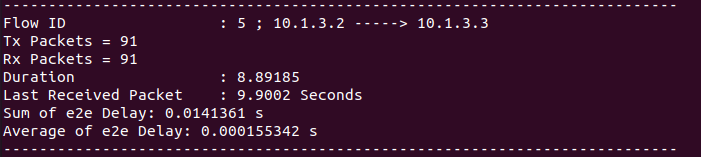
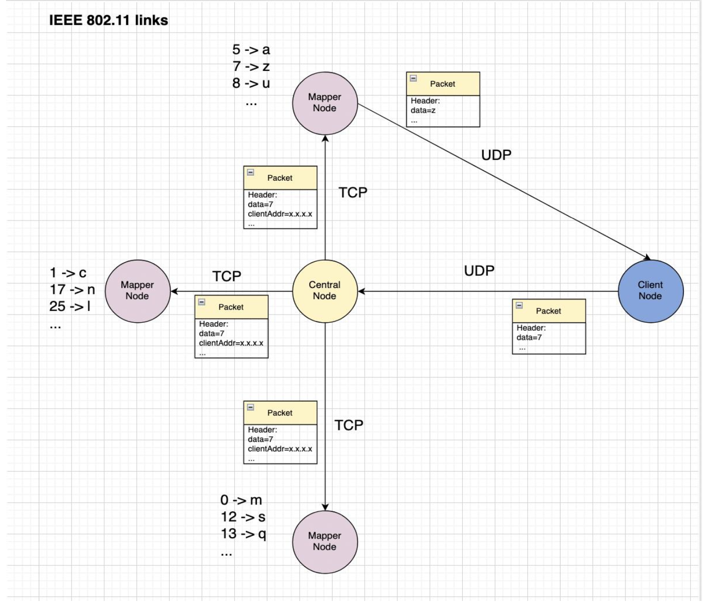

# Wireless Simulation

Wireless Simulation(ns3) ,Second CA of The Computer Networks course @ University of Tehran, spring 2023

Works fine with [ns-3.35](https://www.nsnam.org/releases/ns-3-35/)!

# Report
As we know UDP protocol is connection less so some packets lost when master node want to receive from client or client want to received packets from worker nodes.

 Now we analyse logs of our simulator:

`10.1.3.1 -> clinet node`

`10.1.3.2 -> master node`

`10.1.3.3 -> worker nodes`

As we can see first of all client send a packet with `MyHeader` header and then master send a packet with `DecodedHeader` header to workers and then the worker send a packet with `DecodedHeader` header to client.

Now we explain metrics for monitoring our network:

`Tx Packets`: displays the number of transmitted packets.

`Rx Packets`: displays the number of received packets.

`Duration`: displays time taken by transmission.

`Last Received Packet`: displays the time that last packet received.

`Throughput`: displays how much data actually transfers during a simulation time.

`e2e Delay`: displays the time taken for a packet to be transmited across a network from source to destination.

`Sum of e2e Delay`: displays sum of all packets e2e Delay.

`Average of e2e Delay`: displays (sum of all packets e2e Delay)/packets.

client to master:

master to worker:

worker to master:

And the output message shown bellow:

# What we did

In this assignment, we implemented two headers:

- `DecodedHeader`: The master (central) node uses this to send decoded messages received from the client to the workers (mappers). It also attaches the client's port and IP address to this header so that the workers can figure out how to communicate with the client and deliver the result.
- `EncodedHeader`: This header is used to deliver the associated character to the client from one of the workers.

We then implemented the worker (mapper) class so that it can receive data from the master, process (encode) it, and deliver the result to the client. For this purpose, we used the same UDP approach that was used for client->master communication for worker->client communication. Workers would create new socket for each time they need to send data to the client and after that, they would close the socket and they would not use it again.

For Master->Workers communication, we used the TCP protocol, and for each worker, we have an independent TCP server, and we pass the Inet-address to the server to connect to them. Master would keep sockets created for each worker till end of simulation, so that it can send data to them without creating new sockets each time.

We used different approach for closing the sockets, because Master would send many times data to workers (for each packet from client), but we don't know how many times workers would send data to client (in our case, nearly one third), so we used different approach for closing the sockets.

After receiving each packet (decoded data) from the client, the master creates a DecodedHeader to send the data+client address to workers. This is done sequentially. By using the same port for all workers, the master doesn't need to loop over clients and generate a packet each time.

Top Level description of communications:

